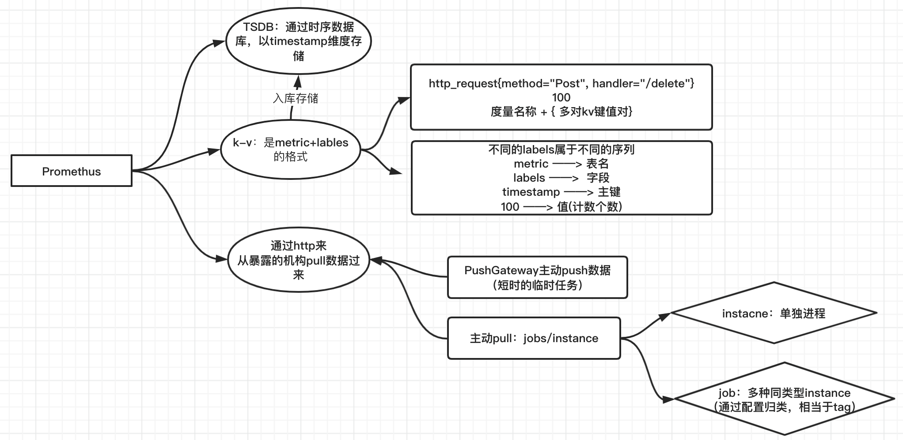

# 通用知识

## 网络带宽、Qps、Tps

- **网络带宽**：单位是bps，多少位bits在1s内被传输，通常为 1GB/s 512KB/s

- **TPS**：Transaction Per sec

  - 每秒的事务数：“事务”具体看如何定义：

    i. 单接口： Client向Server请求 ---> 服务器内部处理 ---->  返回结果给Client

    ​	              | ----------------------     Transcation    -------------------------------------|

    

    ii. 多接口： A 、B、C三个接口

    ​				A接口：Client向Server请求 ---> 服务器内部处理 ---->  返回结果给Client

    ​				B接口：Client向Server请求 ---> 服务器内部处理 ---->  返回结果给Client

    ​				C接口：Client向Server请求 ---> 服务器内部处理 ---->  返回结果给Client

    ​							 | ----------------------     Transcation    -------------------------------------|

    > TPS = 1s内完成Transaction的次数

- **QPS**：Queries Per sec

  - 每秒查询率：通常是指的服务器响应请求
    - 比如：这个接口1mins被访问了600次， QPS = 600次 / 60s = 10 qps

- **区别**：

  - TPS中可能会包含多个QPS，即Transaction会包含多个Queries

## 网关 

### **物理网关**：

> 计网中的网关，是指的是 **同一个广播域** 里面的子网的出口，gateway

### **Restful API:**

RestAPI是一种 **设计理念**：

> **url** 定位资源，**method** 描述操作
>
> 在之前：/room/123
>
> - 打开房间：open/room/123
> - 添加东西：put_something/room/123
>
> 极为混乱
>
> 
>
> 引入 **RestAPI** 理念后
>
> - 打开房间：room/123  GET
> - 关闭房间：room/123  POST

### **API网关** 和 **CGI**

> 一言以蔽之：
>
> - API网关 是通过url分发给不同服务，CGI 是通过对应服务的子url对DB进行不同的操作
> - API网关是 **不同服务**，CGI是 **一种服务下不同的功能**

​					原先每个用户需要访问 **不同url** 来访问不同服务，并且每个服务都要自己做 **流量管理**

> 将这些服务通用的、需要的功能：**服务降级**、**负载均衡**、**流量监控** 抽象出来放到API网关处理

​			CGI实际上是某一个服务内部的一个划分，通用网关接口，通过url对DB有不同的操作

### Nginx

> Nginx就是通常用来实现API网关的一个工具，充当反向代理服务器的作用：

- **正向代理 && 反向代理**

  > 一言以蔽之：  正向隐藏client，反向隐藏server
  >
  > ​						只不过是概念上的偏差、本质上都是走一个代理而已

  

  ​							正向代理：**给Client代理**，Server端看不见Client的ip，只能看见proxy服务器的信息

  

  ​							反向代理：**给Server代理**，Client端看不见访问服务器的ip，只能看见proxy服务器信息

  

- **好处**：

  > 1. 保护**内网安全**，通过中介服务器的方式，可以访问到之前访问不了的资源
  > 2. **负载均衡**，减少原服务器的压力
  > 3. API网关服务器可以用来做**静态文件的缓存**、提高访问速度

- **工作原理**：

> **master进程：**用来管理 worker进程，监听想连接的**socketID**
>
> **woker进程：** 有了**socketID**后，从master里fork出来一个worker进程，worker进程来**accept**这个**socket**
>
> ​					   nginx提供了accept锁，实现当前只有一个进程可以**accept**这个**socket**

## promethus监控

> 1. 类比mysql
>
>    Table = http_request 
>
>    | main_key  | method(post) | handler(/delete) |
>    | --------- | ------------ | ---------------- |
>    | timestamp | 100          | 100              |
>
> 2. 存入时许数据库，维度为time
>
> 3. 通过http从暴露的接口获取数据：
>
>    - pushgateway：临时job主动push
>    - job、instance：promethus主动pull数据

## **Zookeeper详解**

## **Kafka详解**

## **不同DB之间的异同**

### 简介

> 关系型 && 非关系型
>
> - 关系：每条数据都能用表结构描述
> - 非关系：只有一种抽象结构，并不能用表描述(如json)，比如 k-v

- **MySql**

  类型：关系型

  持久化：写入磁盘内 (I/O的消耗大)

  提供服务方式：起进程

- **Redis**

  类型：非关系

  持久化：写到 **内存** 里 (读写速度极快)

  提供服务方式：起进程 (基本上是redis跑到一个实例上，通过Rpc提供服务)

- **RocksDB**

  类型：非关系型

  持久化：写入内存 or 闪存

  提供服务方式：**嵌入式** (库文件方式引入，在你的**进程里起线程**)
  
  
  
  

### **RocksDB**

> levelDB是其前身，优点是嵌入式；k-v类型：抽象起来就仨功能：Put、Get、Delete

- **储存原理**

  > LSM-tree：Log-Structured-Merge Tree，核心思想是：磁盘顺序批量写要比随机写性能高 (因为磁盘针头要寻址)
  >
  > WAL：write ahead log 写前日志

  - **WAL**：

    > 例子如下：
    >
    > 【 add操作只需要往下插就完事儿，O(1)；追加日志就是一个 **顺序IO** 】
    >
    > 写入3 			日志：add-3
    >
    > 写入200		 日志：add-3，add-200
    >
    > 写入1			 日志：add-3，add-200，add-1，...

    - **备份**：通过check日志，对比计划执行（也就是log）和实际执行的来决定do 还是 undo
    - **事务**：修改并不**直接写入数据库文件**，先写入WAL的文件，事务失败，WAL的记录被忽略；事务成功，随后**某个time被写到数据库文件**

    

    

  - **LSM-tree**

​			**写放大**：对 **delete k1** 之后，之前的记录相当于已经无效了，占据多份空间

- TODO
  - 写性能很棒，读性能很痛，log先写到内存，写到一定阈值就flush到磁盘里，更新的操作就是append，所以写的性能很棒
  - 顺序读写 = 读取一个大文件；随机读写 = 读取多条个小文件
  - merge操作：
