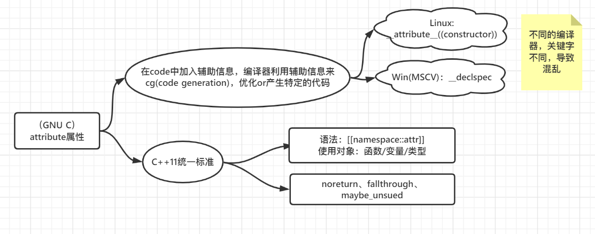

# **Attribute属性**

## 背景

> attribute是什么： 来源于GNU C的一个特性，在代码里添加特定信息改变编译器行为

## 例子

> attribute用来修饰：函数、变量、类型

- noreturn：函数only

~~~cpp
// 告诉编译器这个函数不返回
// 		通常只用在throw上、or调用路径都是exit等非返回函数
//		加入强行返回，会发生未定义行为，编译器只单纯把这函数不返回
[[noreturn]]void case1() {
	throw std::string("error");
}

// case2：编译会warning外，i<=3时，会返回，是未定义行为
[[noreturn]]void case2(int i) {
	if (i>3) {
        throw std::string("error");
    }
}

// 比如exit就是这么定义的
extern void exit() __attribute__((noreturn));

int main() {
    case1();
}
~~~

