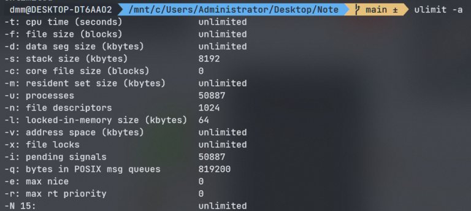
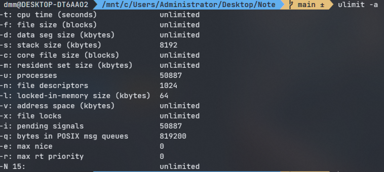
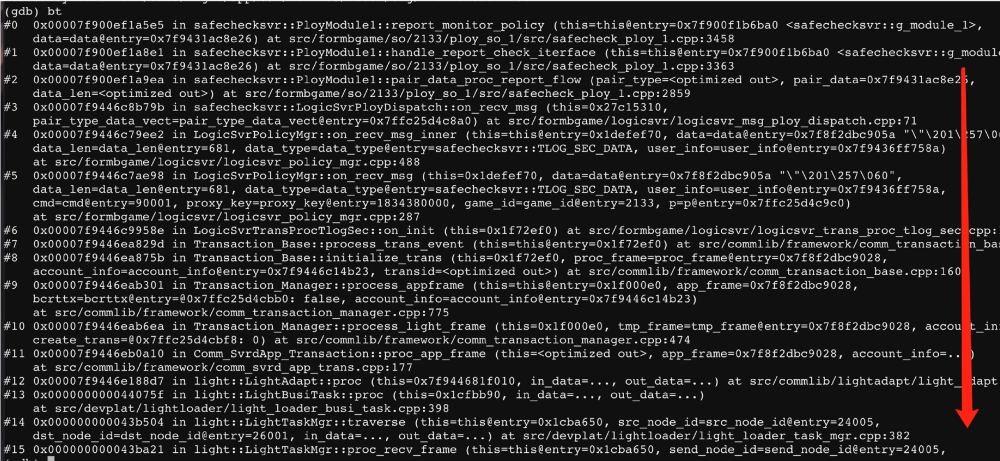
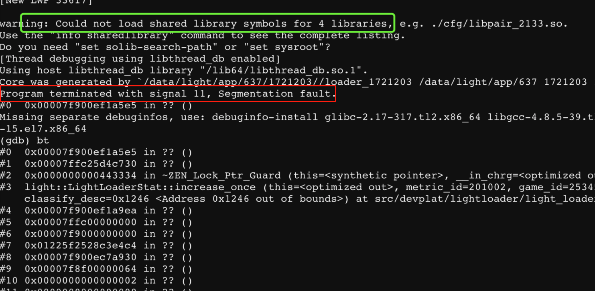
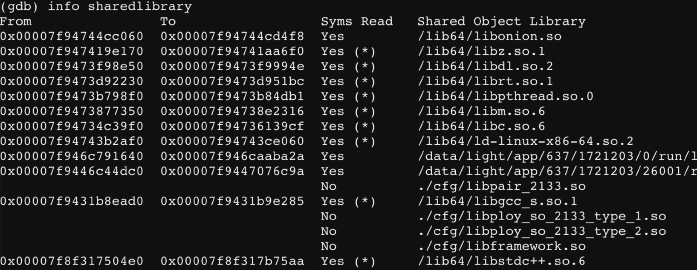
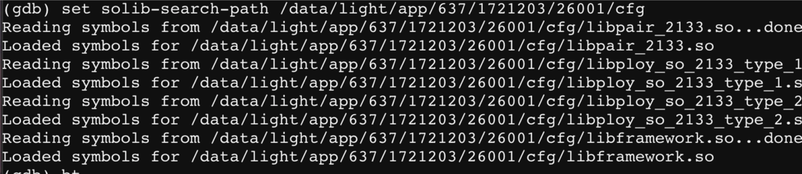

# GDB调试

### 前提工作

- ulimit -a 查看是否允许生成core文件



- ulimit -c unlimited  放开限制



- 自定义生成core的信息

  ```bash
  # 该路径下，设置某些文件来影响core
  /proc/sys/kernel
  ```

  1. 自定义corefile名字

     ```bash
     # 切换超级用户
     sudo su
     # 生成的corefile名会带上core掉进程的 pid
     echo "1" > /proc/sys/kernel/core_uses_pid
     ```

  2. 自定义corefile保存位置 && 名字格式

     ```bash
     echo "/corefile/core_%t_%p" > /proc/sys/kernel/core_pattern
     # %e: 导致core的命令名
     # %t: core的unix时间
     # %p: core的pid
     ```

  > 完成上述步骤，就可以生成corefile了

  

### 基本命令

- 加载gdb

  ```bash
  # 加载core文件
  gdb [exefile] [corefile]
  ```

- 常用操作

  ```bash
  # list -l 显示最近10行代码
  (gdb) l 
  
  # print -p 输出某一个变量值
  (gdb) p var
  (gdb) p *ptr 		# 取得指针值也是可以的
  
  # print type -ptype 查看变量类型
  (gdb) ptype ptr
  (gdb) ptype *ptr
  
  # backtrace/where -bt 输出堆栈信息
  (gdb) bt
  
  # break -b 打断点到某一行
  (gdb) b 10 			# 在第10行打个断点
  
  # run -r 启动程序
  (gdb) r
  
  # set 设置变量
  (gdb) set a = value
  
  # info -i 查看信息
  (gdb) i locals		# 打印当前栈帧的所有局部变量
  (gdb) i sharedLibrary
  (gdb) i f 			# 将当前frame的寄存器信息打印出来
  
  # frame -f 调用栈帧，进入不同栈帧、即进入不同调用的函数，通常配合打印变量使用
  (gdb) f 0			# 进入0栈帧
  
  # 输出函数值，函数名要用引号括起来
  (gdb) p "foo()"
  ```

- 查看堆栈

  

  ​                    堆栈信息从上往下看：栈顶是当前调用栈执行的最后一个函数，执行到这里core掉了

### 常见问题



- **红框部分**：提示 **signal 11**，通过这个信号来确认是因为什么core掉了

- **绿框部分**：表示无法加载某些so（程序用了so的某些代码，但是core掉了）

- **堆栈问号**：这是因为符号表没有加载好的原因

  ```bash
  # 首先要保证，生成的so是带debug信息的，也就是编译的时候带上 -g
  # file xxx.so 查看是否被 striped 了， striped会把调试信息、符号表给干掉
  # shareLibrary 查看哪些so没有被加载
  (gdb) info sharedLibrary
  
  # 然后设置so的寻找路径，把so的路径搞进来
  (gdb) solib-search-path /path/xxx
  
  # 如果堆栈还是坏的，提示：no debugging infos
  # 说明so并没有带上-g选项编译生成，把so带上-g重新编译一份拷贝进来，再load
  ```

  

  

​		gdb堆栈信息完整的保证：**编译带-g参数** && **so不能striped**

- 还是没有办法显示行数怎么办

  ```bash
  # 没有行数，会显示地址
  # 将 可执行文件 or so文件 反汇编
  objdump -d xxxx.out/xxx.so > demo.txt
  # 查看demo.txt 把行数捞出来
  vi demo.txt
  
  # 在so没有被striped的前提下
  file xxx.so 	# 查看是否被striped
  nm xxx.so 		# 输出符号信息
  ```

  