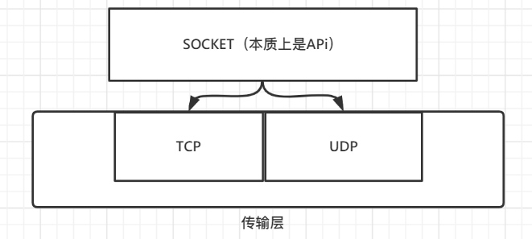

# **Socket详解**

## 什么是socket

> 是**API**，实际上是一种 **系统调用**，通过API来对os内部收发数据进行操作
>
> socket (n.) 插座 ——> 设计之初就打算让它和插座一样，一插上就能通信

- **socket和http有什么不同**:

  > Http：是应用层的一种协议，规定了请求头、请求体格式，最后通过操作socket干出去
  >
  > 事实上：各种应用层协议都操作 **socket** 这一层api来实现各种功能

